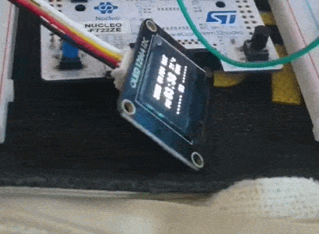
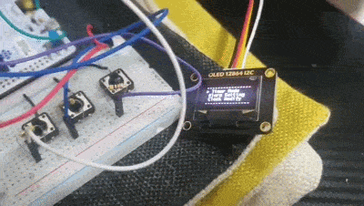
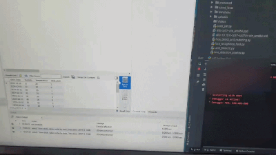
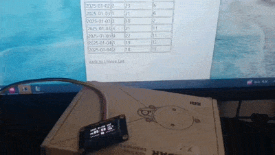

# STM32기반 LCD 디스플레이 시계


## 설명
STM 기반 개인 프로젝트로 임베디드 영상 강의에서 배운 점들을 어떻게 사용해볼까 고민 중

LCD 디스플레이 라디오를 보고 "한번 만들어볼까" 라는 막연한 생각으로 진행한 프로젝트 입니다.

## 개발 기간

**2024.07 ~ 2024.10.31(기본 구성)**

**2024.11 ~ (유지보수 및 추가 기능 기획중... )**

## 수정 내용
- 2025.01.02 : 내부 RTC모듈 대신 DS1302 모듈을 사용해 보드 전원 리셋 후 설정 시간의 안정성 보장 및 알람 데이터 유실 방지
- 2025.01.02 : 무료 Cloud 기반 MQTT 통신을 통한 온 습도 데이터 전송 방식으로 변경(보안 및 안정성 강화) 
- 2025.01 : 알람 설정시 특정 아이콘 디스플레이 계획중

## 사용 제품

 |
--- | --- | 

 | | |
--- | --- | --- |  --- |

 |
--- | --- | 

## 사용 기술


## 사용 GPIO 정보


## STM32CubeIDE 설정


|
--- | --- |


 | |
--- | --- | --- |


 | |
--- | --- | --- |


### 프로젝트 구조 (Project Structure)

```text
.
├── arduino/           # ESP32 MQTT & Wi-Fi Bridge (데이터 중계)
├── firmware/          # STM32 Main Control Logic (HAL 기반 메인 로직)
│   ├── Core/Lib/      # 디바이스 드라이버 (DHT11, SSD1306, DS1302 등)
│   └── Core/Src/      # 인터럽트 핸들러 및 타이머 제어 로직
├── flask/             # Oracle Cloud 기반 백엔드 및 모니터링 대시보드
└── images/            # 기능 시연 GIF 및 시스템 하드웨어 구성도
```

## 구현 기능

### 1. 시간 및 온 습도 디스플레이


| |  |
|---|---|


### 2. 알람 기능


| <div align="center"><video src="https://github.com/user-attachments/assets/6e7b8945-9393-4358-a77d-e7966be5a958" width="200" controls></video><br>알람 시간 설정</div> | <div align="center"><video src="https://github.com/user-attachments/assets/8eb108ee-4683-4b23-9234-9c692538e95f" width="200" controls></video><br></div>  ![알람 시간시 부저 작동 및 종료(LCD 디스플레이 및 내부 스위치를 통한 타이머 부저 종료)] (./images/메뉴_화면.gif)|
|---|---|


### 3. 타이머 기능


#### - 타이머 설정 및 타이머 종료(LCD 디스플레이 및 내부 스위치를 통한 타이머 부저 종료)
https://github.com/user-attachments/assets/a1fedf04-4a7d-40f4-89ef-b98247bda895


### 4. 날짜 및 시간 변경 기능

#### - 초기에 날짜 및 시간 설정(time.h 라이브러리 기반 날짜 자동 업데이트)

https://github.com/user-attachments/assets/25368d83-5319-44fb-b22b-696598ec7078


### 5. 특정 시간 마다 온 습도 정보 서버 전송

#### - 하루에 특정시간(0시, 6시, 12시, 18시)에 온습도 데이터 서버 전송 및 DB 업데이트)
| |  |
|---|---|


## 참고 블로그 및 영상강의
- [아날로그 핀 설정](https://m.blog.naver.com/sinbong3/222072690691)
- [Python FLASK_MYSQL_연동](https://minha0220.tistory.com/75#google_vignette)
- [ESP32_STM32_WIFI_BRIDGE 관련 블로그](https://with-rl.tistory.com/entry/ESP32-STM32%EB%A5%BC-%EC%9D%B4%EC%9A%A9%ED%95%9C-WiFi-Serial-Bridge-%EB%A7%8C%EB%93%A4%EA%B8%B0)
- [오제이 튜브 임베디드 영상 강의](https://www.youtube.com/playlist?list=PLz--ENLG_8TNjRg1OtyFBvUyV4PHaKwmu)
- [DS1302 참고 블로그](https://blog.naver.com/darknisia/222286092630?)

## GitHub Reference
- [SSD1306_HAL_DRIVER](https://github.com/SL-RU/stm32libs/tree/master)
- [DHT11 HAL_DRIVER](https://github.com/mesutkilic/DHT11-STM32-Library)
- [DS1302 HAL_DRIVER](https://github.com/aaron-ev/driver-ds1302-stm32f4)
